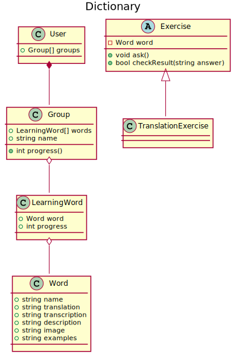

<!--
```
@startuml classDiagram01

title Dictionary

class Word {
  +string name
  +string translation
  +string transcription
  +string description
  +string image
  +string examples
}

class LearningWord {
  +Word word
  +int progress
}

class Group {
  +LearningWord[] words
  +string name
  +int progress()
}

class User {
  +Group[] groups
}

abstract class Exercise {
  -Word word
  +void ask()
  +bool checkResult(string answer)
}

class TranslationExercise {}

User *-- Group
Group o-- LearningWord
LearningWord o-- Word
Exercise <|-- TranslationExercise

@enduml
```
-->

